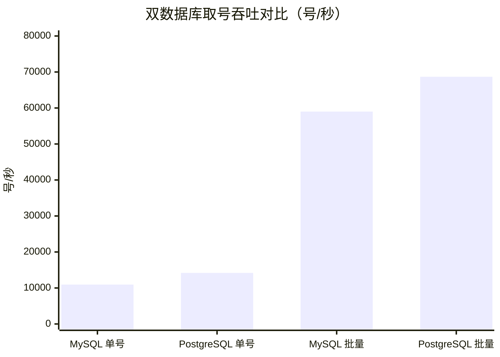

# id-generator

   

全局唯一 ID 序列生成器，基于号段（segment）模式实现。服务为每个业务维度维护一段连续可发的 ID 区间，业务方每次取号直接从内存缓冲中获取，仅在号段耗尽时才访问数据库申请新号段，以极低的数据库压力支撑高频发号。

## 核心特性

- **号段模式发号**：数据库仅记录每个业务维度的已分配最大值与步阶，取号走内存缓冲，数据库交互频次约为步阶分之一
- **双数据库支持**：同时支持 MySQL 与 PostgreSQL，通过 Spring profile 切换，业务代码完全一致
- **三级层级管理**：业务组（bizGroup）→ 业务名（bizTag）→ 号段（segment）逐级登记，必须先申请业务组，再申请业务名，最后才能创建号段
- **命名约束**：业务组与业务名仅允许英文字母/数字/下划线/中划线（`^[a-zA-Z0-9_-]+$`），最长 100 字符
- **并发安全**：数据库侧带原值校验的步阶推进，多实例部署下天然保证区间不重叠；业务组与业务名组合建唯一索引，防止重复申请
- **余量预取**：每个序列的缓冲区维持在安全下限与上限之间，余量不足时异步补充，避免取号请求阻塞在数据库上
- **动态感知**：定时同步已申请序列，新申请的序列自动进入发号缓存，废弃的序列自动移除

## 快速开始

前置条件：JDK 8+，Maven，本地 MySQL 或 PostgreSQL。

1. 执行对应数据库的建表脚本创建库与表：

```bash
# MySQL
mysql -uroot -p < src/main/resources/script-mysql.sql

# PostgreSQL
psql -h localhost -U admin -d postgres -f src/main/resources/script-postgresql.sql
```

2. 通过 Spring profile 选择数据库，默认 `mysql`。MySQL 连接配置见 [application-mysql.properties](src/main/resources/application-mysql.properties)，PostgreSQL 连接配置见 [application-postgresql.properties](src/main/resources/application-postgresql.properties)，均默认连接本机的 `id_generator_db` 库

3. 启动服务，使用 PostgreSQL 时显式指定 profile：

```bash
# MySQL(默认)
mvn spring-boot:run

# PostgreSQL
mvn spring-boot:run -Dspring-boot.run.profiles=postgresql
```

## 表结构

建表脚本按数据库提供：MySQL 用 [script-mysql.sql](src/main/resources/script-mysql.sql)，PostgreSQL 用 [script-postgresql.sql](src/main/resources/script-postgresql.sql)。两套脚本共三张表，分别对应业务组、业务名、号段三个层级：

`id_group` 业务组表：

| 列 | 类型 | 说明 |
| --- | --- | --- |
| id | bigint | 自增主键 |
| biz_group | varchar(100) | 业务组名，唯一 |
| description | varchar(500) | 备注说明 |
| created_at / updated_at | datetime | 创建与更新时间（UTC），PostgreSQL 侧为 timestamptz 类型 |

`id_tag` 业务名表：

| 列 | 类型 | 说明 |
| --- | --- | --- |
| id | bigint | 自增主键 |
| biz_group | varchar(100) | 所属业务组 |
| biz_tag | varchar(100) | 业务名，与业务组组合唯一 |
| description | varchar(500) | 备注说明 |
| created_at / updated_at | datetime | 创建与更新时间（UTC），PostgreSQL 侧为 timestamptz 类型 |

`id_segment` 号段表，核心发号数据：

| 列 | 类型 | 说明 |
| --- | --- | --- |
| id | bigint | 自增主键 |
| biz_group | varchar(100) | 业务组，与业务名组合唯一 |
| biz_tag | varchar(100) | 业务名 |
| current_max_id | bigint unsigned | 当前已分配出去的最大 ID 值 |
| step | bigint unsigned | 步阶，每次申请新号段的区间长度，默认 1000 |
| description | varchar(500) | 备注说明 |
| created_at / updated_at | datetime | 创建与更新时间（UTC），PostgreSQL 侧为 timestamptz 类型 |

取号推进逻辑：新号段区间为 (已分配最大值, 已分配最大值 + 步阶]，推进成功后已分配最大值增加一个步阶，同时由应用显式刷新更新时间（UTC），不依赖数据库的自动刷新特性。

## API 说明

所有接口均为 POST，请求与响应均为 JSON，服务地址默认 `http://localhost:8080`。

响应统一结构：`code` 为 0 表示成功，非 0 表示失败；`message` 为提示信息；`data` 为业务数据。

### 申请业务组

`POST /api/common/apply-group`

```bash
$ curl \
--request POST \
http://localhost:8080/api/common/apply-group \
--header 'Content-Type: application/json' \
-d '{"bizGroup":"order","description":"订单业务"}'
```

同名业务组已存在时幂等返回，不会重复创建。

### 申请业务名

`POST /api/common/apply-tag`，所属业务组必须已申请：

```bash
$ curl \
--request POST \
http://localhost:8080/api/common/apply-tag \
--header 'Content-Type: application/json' \
-d '{"bizGroup":"order","bizTag":"main","description":"订单主表ID"}'
```

所属业务组不存在时申请失败；同名业务名已存在时幂等返回。

### 申请新序列

`POST /api/common/apply-segment`，所属业务组与业务名必须均已申请：

```bash
$ curl \
--request POST \
http://localhost:8080/api/common/apply-segment \
--header 'Content-Type: application/json' \
-d '{"bizGroup":"order","bizTag":"main","currentMaxId":10000,"step":1000,"description":"订单主表ID"}'
```

`currentMaxId` 与 `step` 可省略，缺省时使用配置的默认初始值（10000）与默认步阶（1000）。同名序列已存在时幂等返回，不会重复创建。新申请的序列会在一个同步周期（默认 10 秒）后进入发号缓存。

### 分页查询业务组

`POST /api/common/page-group`，`bizGroup` 可省略，省略时查全量，条件为模糊匹配：

```bash
$ curl \
--request POST \
http://localhost:8080/api/common/page-group \
--header 'Content-Type: application/json' \
-d '{"current":1,"pageSize":10,"bizGroup":"order"}'
```

`data` 内为 `list`（当前页数据）与 `pagination`（`total` 总条数、`pages` 总页数、`current` 当前页码、`pageSize` 每页数量），结果按登记顺序排列。

### 分页查询业务名

`POST /api/common/page-tag`，`bizGroup` 为精确匹配，`bizTag` 为模糊匹配，均可省略：

```bash
$ curl \
--request POST \
http://localhost:8080/api/common/page-tag \
--header 'Content-Type: application/json' \
-d '{"current":1,"pageSize":10,"bizGroup":"order","bizTag":"main"}'
```

### 分页查询序列

`POST /api/common/page-segment`，`bizGroup` 与 `bizTag` 均为精确匹配，均可省略：

```bash
$ curl \
--request POST \
http://localhost:8080/api/common/page-segment \
--header 'Content-Type: application/json' \
-d '{"current":1,"pageSize":10,"bizGroup":"order"}'
```

返回的每条记录包含已分配最大值、步阶与备注说明，可用于管控台巡检号段水位。

### 取 1 个 ID

`POST /api/common/take-segment`

```bash
$ curl \
--request POST \
http://localhost:8080/api/common/take-segment \
--header 'Content-Type: application/json' \
-d '{"bizGroup":"order","bizTag":"main"}'
```

### 取 N 个 ID

`POST /api/common/take-segment/{n}`，n 为本次申请的 ID 数量，必须大于 0：

```bash
$ curl \
--request POST \
http://localhost:8080/api/common/take-segment/10 \
--header 'Content-Type: application/json' \
-d '{"bizGroup":"order","bizTag":"main"}'
```

## 性能压测

压测工具与详细使用说明见 [benchmark](benchmark/README.md)，包含吞吐压测与取号正确性校验两类工具，均为单文件 Java 程序。

测试环境：8 核 MacBook，JDK 8，服务端与压测器同机互相争抢 CPU，桌面环境有其他负载，以下数据属保守口径；独立压测机（服务端独占 CPU）按瓶颈分析推算可达 2.2 万 QPS 以上。

### 吞吐对比



单号接口与批量接口（10 号/请求）的吞吐按相同量纲（号/秒）展示，批量摊薄每号成本的效果与两库差距一目了然：

- 单号接口：MySQL 10935 QPS（压测连接池未解锁口径，属保守值），PostgreSQL 14193 QPS，均零失败
- 批量接口：MySQL 约 5.9 万号/秒，PostgreSQL 约 6.87 万号/秒
- 批量不足额：MySQL 24.4 万请求中 10 例（约 0.004%），PostgreSQL 20.6 万请求中 2 例（约 0.001%），均为有界降级，返回的号本身正确

### 正确性校验

两种数据库各做单号与批量两轮全量校验，合计约 119 万个号：

| 校验项 | 结果 |
| --- | --- |
| 首号衔接（与库内推进值/上轮末号） | 全部精确衔接 |
| 重复号 | 0 |
| 跳号 | 0 |
| 数据库推进守恒 | 推进值对齐段边界且覆盖全部已发出号 |
| 服务端异常日志 | 0 |

### 瓶颈定位结论

每请求约 0.3ms CPU 全部消耗在 Web 层请求管道，取号缓存逻辑（读写锁与原子变量）不构成热点；同机压测下服务端仅分得约 4.3 核。批量取号接口可将每号成本摊薄一个数量级，是提升取号吞吐的首选方式；更高吞吐可通过多实例水平扩展获得，号段模式天然支持。

## 配置项

| 配置 | 默认值 | 说明 |
| --- | --- | --- |
| spring.profiles.active | mysql | 数据库选择，可选 mysql 或 postgresql，对应各自的连接配置文件 |
| mybatis-plus.global-config.db-config.schema | （仅 postgresql 配置为 public） | PostgreSQL 侧显式限定表所属模式，MySQL 侧不配置 |
| id.segment.default.init_id | 10000 | 申请新序列时缺省的初始已分配最大值 |
| id.segment.default.step | 1000 | 申请新序列时缺省的步阶 |

## 许可证

[MIT](LICENSE)
